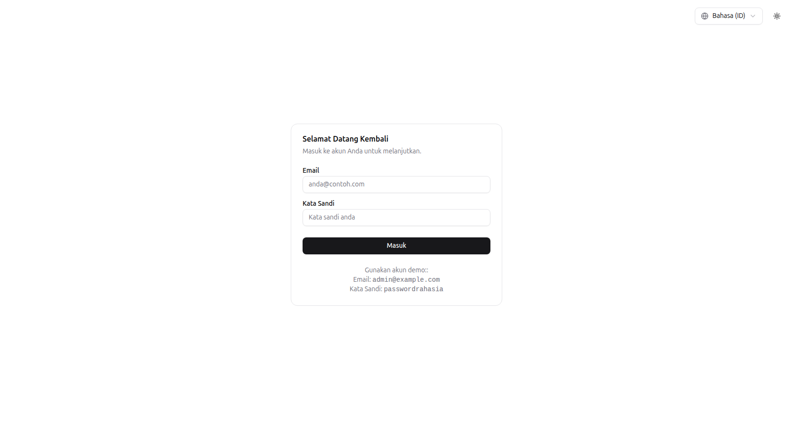
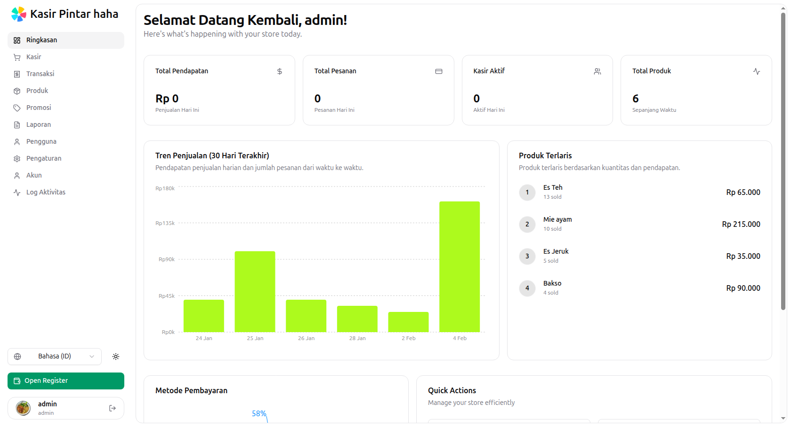
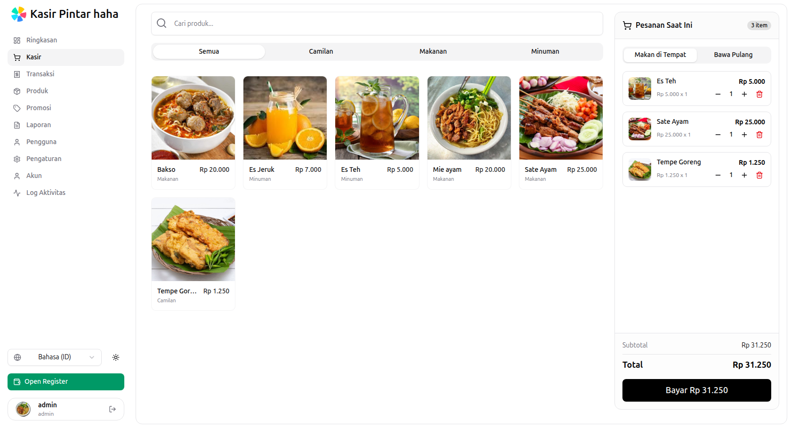
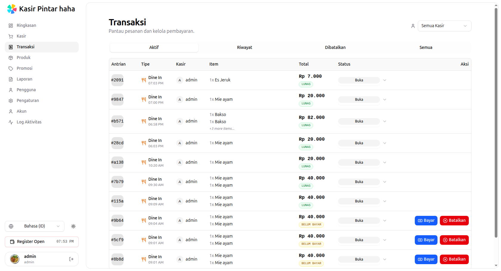
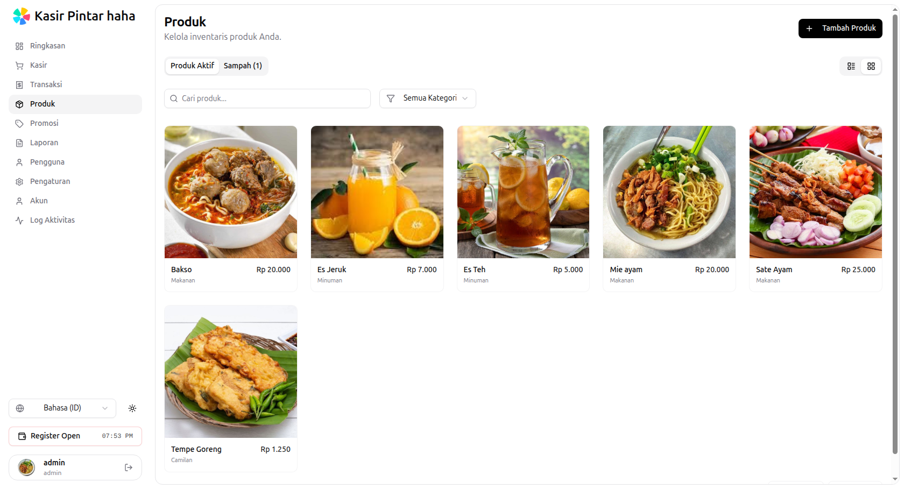
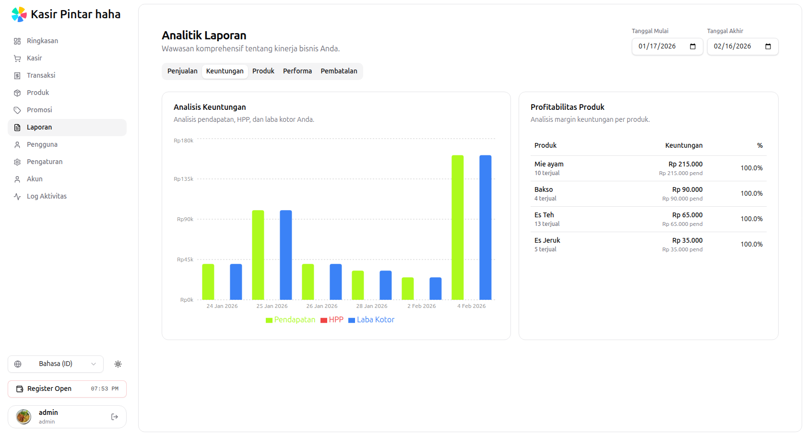
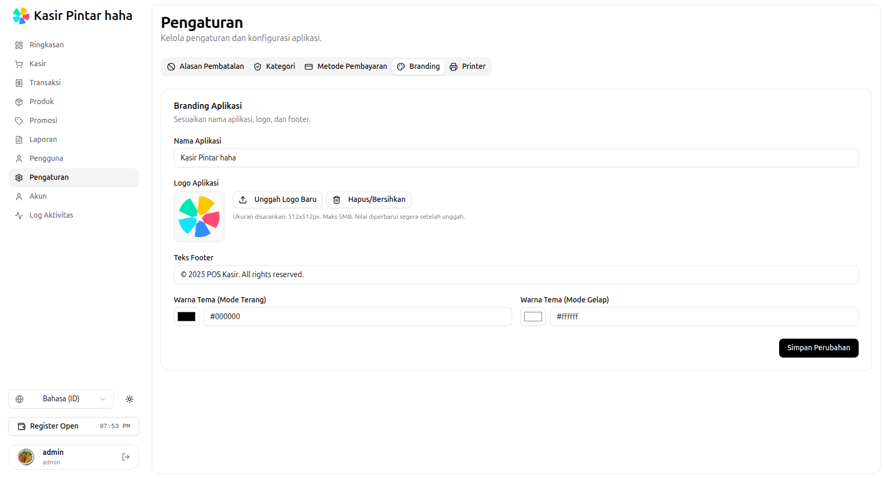
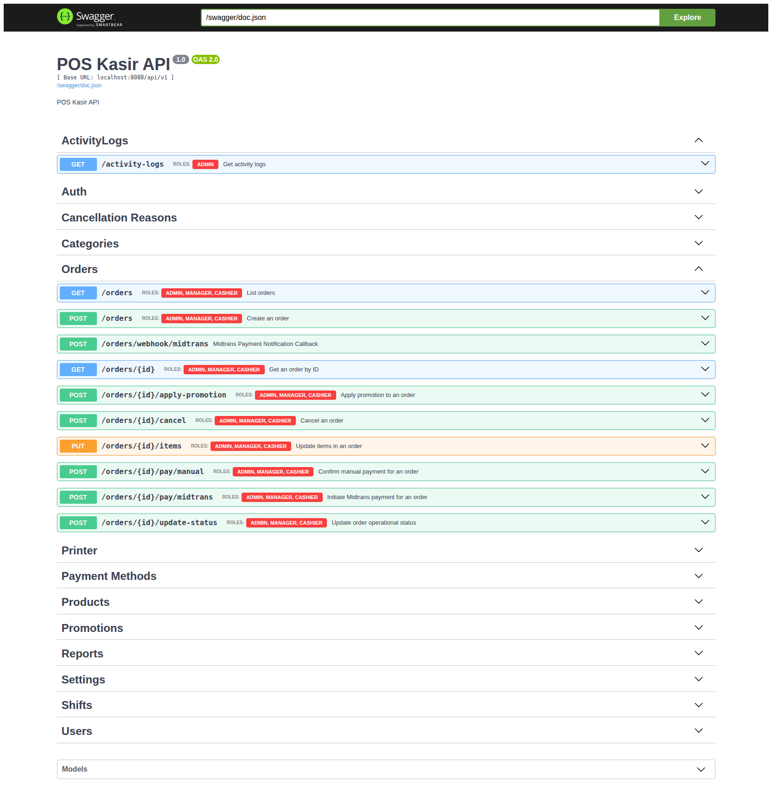

# **POS Kasir (Point of Sales System)**

<a href="https://pos-kasir.agprastyo.me/">
  
</a>

<a href="https://api-pos.agprastyo.me/api/v1/swagger/index.html">
  
</a>

## **Overview**

**POS Kasir** is a modern, high-performance Fullstack Point of Sales application designed to streamline retail operations. It provides a robust solution for managing products, processing orders, handling payments (including Digital Payments via Midtrans), and analyzing sales performance.

Built with **scalability** and **type-safety** in mind, the backend leverages **Golang** with **Fiber** and **sqlc**, while the frontend offers a seamless user experience using the bleeding-edge **TanStack Start** framework powered by **Bun**.

**Note:** This project serves as a portfolio showcase demonstrating full-stack development capabilities, system architecture design, and integration of third-party services.

## **✨ Key Features**

### **Core Functionality**

* **User Management & RBAC:** Secure authentication with JWT. Role-based access control for Admins and Cashiers.
* **Inventory Management:** Create, update, and organize products with categories. Support for product variants/options.
* **Order Processing:** Efficient cart system and order placement workflow.
* **Transactions:** Detailed transaction history and receipt generation.

### **Advanced Features**

* **Digital Payments:** Integrated with **Midtrans Payment Gateway** for seamless cashless transactions.
* **Cloud Storage:** Integration with **Cloudflare R2** for efficient and scalable product image storage.
* **Dashboard & Analytics:** Comprehensive reports on sales, cashier performance, and popular products.
* **Activity Logging:** Complete audit trails for tracking system changes and user activities.
* **Multi-language Support:** Frontend i18n support (English/Indonesian).

> ⚠️ Payment integration is running in sandbox mode for demonstration purposes.

## System Architecture

Frontend (TanStack Start) communicates with the backend via RESTful API.
The backend handles authentication, business logic, and integrations with third-party services such as Midtrans and Cloudflare R2.
PostgreSQL is used as the primary relational database.

Authentication is handled using JWT with role-based access control.

## **Tech Stack**

### **Backend (API)**

* **Language:** [Go (Golang)](https://www.google.com/search?q=https://go.dev/)
* **Framework:** [Fiber v2](https://www.google.com/search?q=https://gofiber.io/) \- High-performance web framework.
* **Database:** PostgreSQL.
* **ORM/Query Builder:** [sqlc](https://www.google.com/search?q=https://sqlc.dev/) \- For generating type-safe Go code from SQL.
* **Migrations:** Golang Migrate.
* **Docs:** Swagger (Swaggo).
* **Utils:** air(hot-reload), Logrus (Logging).

### **Frontend (Web)**

* **Runtime:** [Bun](https://www.google.com/search?q=https://bun.sh/)
* **Framework:** [TanStack Start](https://www.google.com/search?q=https://tanstack.com/start/latest) (React).
* **State & Data Fetching:** [TanStack Query](https://www.google.com/search?q=https://tanstack.com/query/latest).
* **UI Component:** [Shadcn UI](https://www.google.com/search?q=https://ui.shadcn.com/) \+ Tailwind CSS.
* **Form Handling:** React Hook Form \+ Zod.
* **API Client:** OpenAPI Generator (generated from Backend Swagger).

### **Infrastructure & Tools**

* **Containerization:** Docker & Docker Compose.
* **Hot Reload:** Air (Backend).
* **Automation:** Makefile.

## **Project Structure**

.  
├── cmd/                \# Main applications entry points  
│   ├── app/            \# Main server application  
│   └── seeder/         \# Database seeder  
├── config/             \# Configuration loading logic  
├── internal/           \# Private application and business logic  
│   ├── auth/           \# Authentication logic  
│   ├── orders/         \# Order processing  
│   ├── products/       \# Product management  
│   ├── repository/     \# Generated sqlc code  
│   └── ...  
├── pkg/                \# Public library code (Logger, Midtrans, R2, Utils)  
├── sqlc/               \# SQL queries and schema  
├── web/                \# Frontend application (TanStack Start)  
├── docker-compose.yml  \# Docker orchestration  
└── Makefile            \# Command runner

## **Getting Started**

### **Prerequisites**

* **Go** 1.22+
* **Bun** 1.0+ (for frontend)
* **Docker** & **Docker Compose**

### **1\. Clone the Repository**

```bash
git clone https://github.com/agpprastyo/POS-kasir.git  
cd POS-kasir
```

### **2\. Project Setup**

1. Copy environment files and configure your credentials:

    ```bash
    cp .env.example .env
    cp web/.env.example web/.env
    ```

2. Update `.env` with your database, Midtrans, and Cloudflare R2 credentials.
3. start docker containers:

    ```bash
    docker-compose up -d
    ```

4. Run database migrations:

    ```bash
    make migrate-up
    ```

5. (Optional) Seed the database with sample data:

    ```bash
    make seed
    ```

6. visit [http://localhost:3000](http://localhost:3000) for the frontend and [http://localhost:8080/swagger/index.html](http://localhost:8080/swagger/index.html) for the API docs.

## **📸 Screenshots**

| Login Page | Dashboard |
| :----: | :----: |
|  |  |

| Point of Sales (POS) | Payment & Checkout |
| :----: | :----: |
|  |  |

| Transaction History | Product Management |
| :----: | :----: |
|  |  |

| Reports & Analytics | Settings |
| :----: | :----: |
|  |  |

| API Documentation (Swagger) |
| :----: |
|  |

## **API Documentation**

The backend includes auto-generated Swagger documentation.

* **Live Specs:** [https://api-pos.agprastyo.me/swagger/index.html](https://www.google.com/search?q=https://api-pos.agprastyo.me/swagger/index.html)
* **Live Base URL:** <https://api-pos.agprastyo.me/api/v1>

**Running Locally:**

Once the local server is running, visit:

<http://localhost:8080/swagger/index.html>

## **License**

This project is licensed under the [MIT License](https://www.google.com/search?q=LICENSE).

## Author

**Agung Prasetyo**

* GitHub: <https://github.com/agpprastyo>
* LinkedIn: <https://www.linkedin.com/in/agprastyo>
* Portfolio: <https://portfolio.agprastyo.me>
