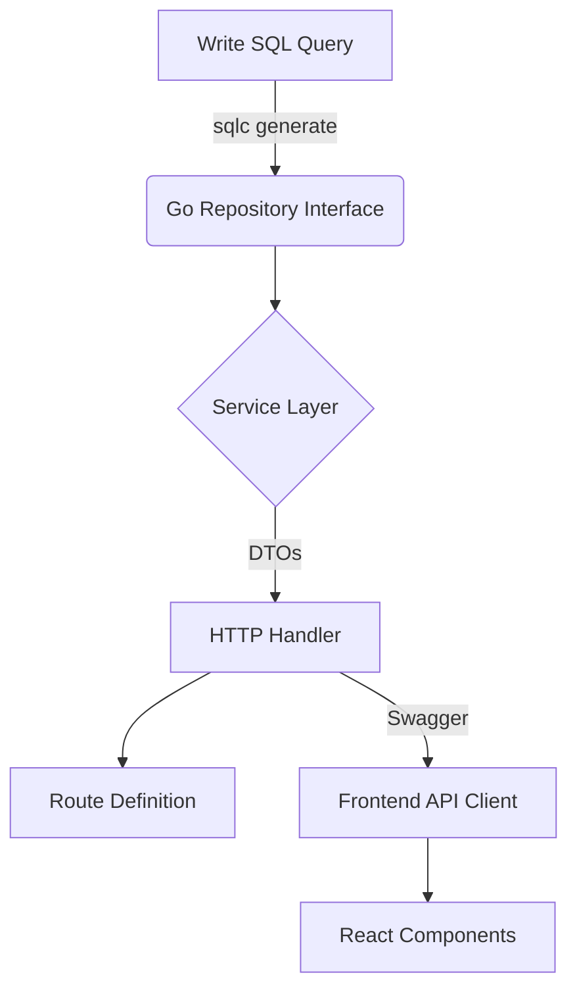

# POS Kasir - Modern Point of Sales System

A full-stack Point of Sales (POS) application built with performance, type safety, and developer experience in mind. This project showcases a modern architecture connecting a high-performance Go backend with a responsive, optimistic React frontend.

---

## 🚀 Project Overview

**POS Kasir** is designed to streamline retail operations, offering a seamless experience for cashiers and powerful insights for managers. It features real-time transaction processing, comprehensive inventory management, and deep analytics.

**Why this technology?**
The stack was chosen to demonstrate:

- **Performance**: Go and Fiber provide near-instant API responses.
- **Type Safety**: End-to-end type generation from SQL queries (`sqlc`) to Frontend API clients (`openapi-generator`).
- **UX/UI**: A "premium feel" interface using Shadcn/UI and framer-motion, with TanStack Query handling caching and background updates.

## 🛠 Tech Stack

### Backend

- **Language**: [Go (Golang)](https://go.dev/) 1.22+
- **Framework**: [Fiber](https://gofiber.io/) (Express-inspired, zero allocation)
- **Database**: PostgreSQL
- **ORM-ish**: [SQLc](https://sqlc.dev/) (Generate type-safe Go code from pure SQL)
- **Authentication**: JWT with Role-Based Access Control (RBAC)
- **Documentation**: Swagger/OpenAPI (Auto-generated)

### Frontend

- **Framework**: [React](https://react.dev/) + [Vite](https://vitejs.dev/)
- **Routing**: [TanStack Router](https://tanstack.com/router) (Type-safe routing)
- **State/Data**: [TanStack Query](https://tanstack.com/query) (Async state management)
- **UI Component**: [Shadcn/UI](https://ui.shadcn.com/) + Tailwind CSS
- **Runtime**: [Bun](https://bun.sh/)

### Development Workflow

This project follows a strict **Type-Safe / Contract-First** development flow:



1. **Database First**: Define schema and queries in SQL.
2. **Generate Code**: `sqlc` generates Go struct and interfaces.
3. **Implement Logic**: Services handle business rules; Handlers manage HTTP transport.
4. **Sync Frontend**: OpenAPI generator creates typed TypeScript clients for the frontend, ensuring the UI is always in sync with API changes.

## ✨ Key Features

- **🔐 Authentication & Security**: Secure JWT login with role-based protection (Admin, Cashier).
- **🛒 Point of Sales (POS)**: Fast, keyboard-friendly checkout interface with cart management, discounts, and tax calculation.
- **📦 Inventory Management**: CRUD operations for products and categories with image uploading.
- **📊 Reports & Analytics**:
  - Sales trends (Last 30 days).
  - Top-selling products.
  - Cashier performance leaderboards.
  - Payment method distribution.
- **📑 Activity Logging**: Comprehensive audit trail of all system actions (Admin only).
- **🌍 Localization**: Full English and Indonesian (Bahasa Indonesia) support.

## 📂 Architecture & Folder Structure

```
.
├── cmd/                # Application entry points
├── internal/
│   ├── activitylog/    # Activity Logging Module
│   ├── auth/           # Authentication Module
│   ├── common/         # Shared utilities and response wrappers
│   ├── config/         # Environment configuration
│   ├── database/       # Database connection setup
│   ├── dto/            # Data Transfer Objects (Request/Response structs)
│   ├── middleware/     # Fiber middlewares (Auth, Logger, CORS)
│   ├── orders/         # Order Management Module
│   ├── product/        # Product & Category Module
│   ├── reports/        # Reporting Module
│   ├── repository/     # SQLc generated code (Data Access Layer)
│   └── user/           # User Management Module
├── sqlc/               # SQL queries and configuration
├── web/                # Frontend React Application
│   ├── src/
│   │   ├── components/ # Reusable UI components
│   │   ├── lib/api/    # Generated API Clients & Query Hooks
│   │   └── routes/     # TanStack Router File-based routing
└── README.md
```

## 📸 Screenshots

*(Add screenshots here to your portfolio)*

| **Login** | **Dashboard** |
|:---:|:---:|
|  |  |

| **POS Interface** | **Reports** |
|:---:|:---:|
|  |  |

> **Suggested Screenshots for Showcase:**
>
> 1. **Login Page**: Demonstrating clean design and security.
> 2. **Dashboard**: Showing the "Wow" factor with charts and summary widgets.
> 3. **POS Interface**: The main working area with grid layout and cart.
> 4. **Transactions History**: Showing list views and status badges.
> 5. **Activity Logs**: Demonstrating admin capabilities.

## 🚀 Getting Started

### Prerequisites

- [Go](https://go.dev/) 1.22+
- [Bun](https://bun.sh/) (for frontend)
- [Docker](https://www.docker.com/) (for Database)

### Installation

1. **Clone the repository**

    ```bash
    git clone https://github.com/yourusername/pos-kasir.git
    cd pos-kasir
    ```

2. **Setup Database**

    ```bash
    docker-compose up -d postgres
    # Ensure migrations are applied (if using golang-migrate or similar)
    ```

3. **Run Backend**

    ```bash
    go mod download
    go run main.go
    # Server starts on http://localhost:8080
    ```

4. **Run Frontend**

    ```bash
    cd web
    bun install
    bun dev
    # UI starts on http://localhost:5173
    ```

## 🔮 Future Improvements

- [ ] WebSocket integration for real-time order updates to kitchen display.
- [ ] Hardware integration (Thermal Printers, Barcode Scanners).
- [ ] Offline support using PWA capabilities.

---
*Built with ❤️ by [Your Name]*
